

# Features:
## Login Screen
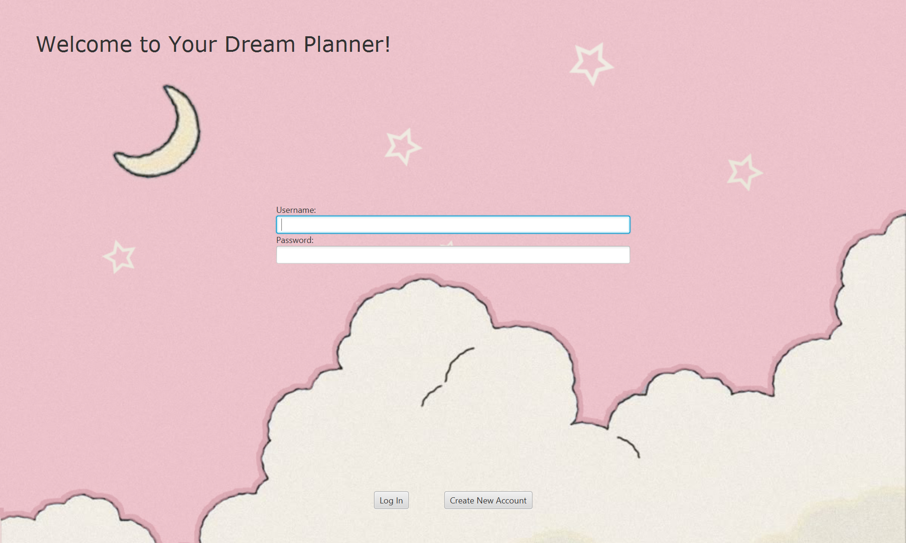
Features a login screen that allows users to input their username and password and log into their saved account.
User log in can be completed by pressing enter or pressing the “Log In” button. 
Log In Screen uses the PlannerController to check for the corresponding username and password in our username.csv

## Create New Account Screen
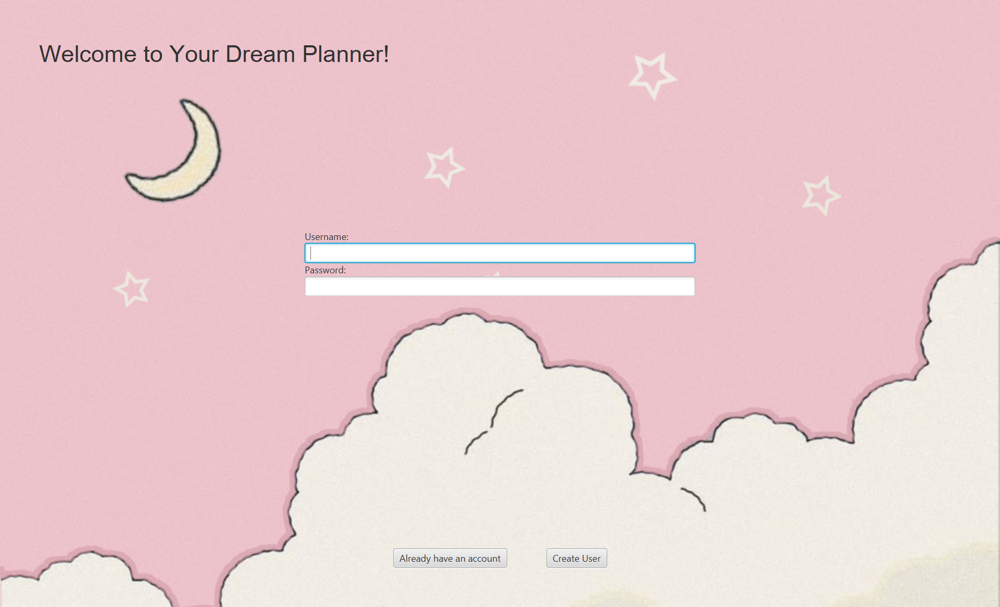
Similar to the login screen, it allows users to input their preferred username and password and create a new account
Users will then be directed to continue back to the login screen to log in formally!
Create New Account Screen uses the PlannerController to add the new username and password in our username.csv

## Dashboard
Our Dashboard utilizes Three Layouts that can be switched between using the view dropdown selector! 
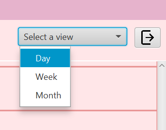

The button next to the dropdown allows the user to log out from the dashboard and return to the login screen.

### Month View
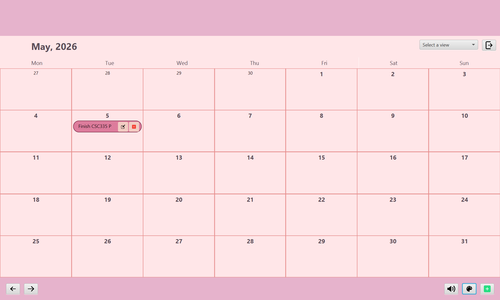
Displays all the days in a month, showing days from previous months if applicable!
Utilizes a GridPane to represent all the days.
Tasks can be edited and deleted from within the month view!

### Week View
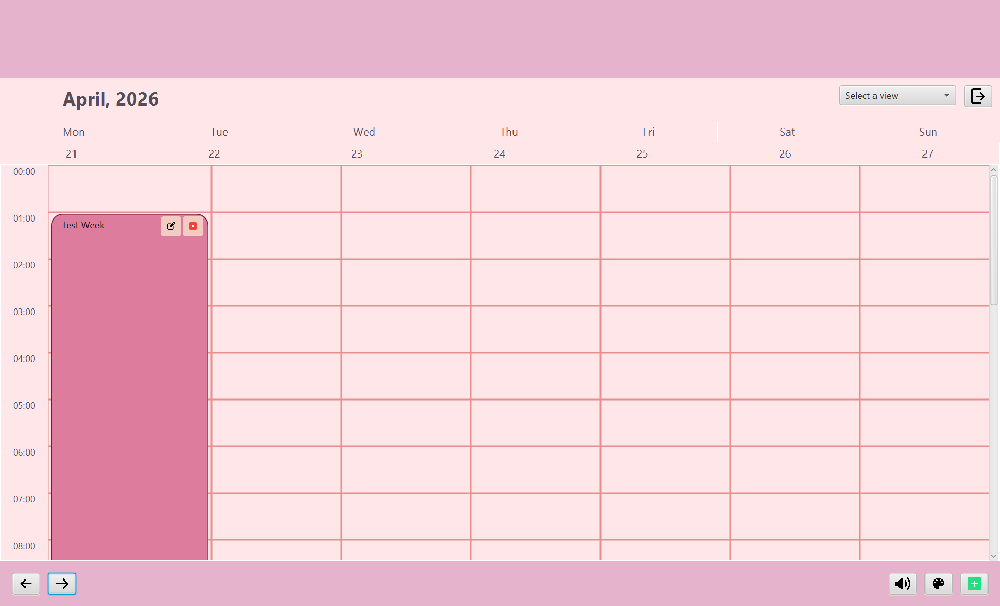
Displays all the days in a week!
Utilizes a GridPane to represent all the days and their hours.
Tasks can be edited and deleted from within the week view!

### Day View
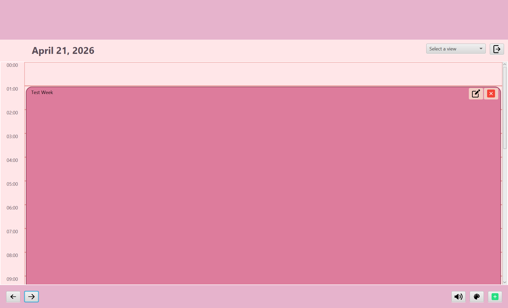
Displays all the tasks and hours in a day!
Utilizes a GridPane to represent all the hours in a day.
Tasks can be edited and deleted from within the day view!

## Interaction Bar

### Features:
- Previous Button, responsible for navigating to the previous time period for viewing
- Forward Button, responsible for navigating to the next time period for viewing
- Music Box Button, shows Music Box Pop Up
- Color Customization Button, shows Color Customization Pop Up
- Add Task Button, shows Add Task Pop Up

### Add Tasks
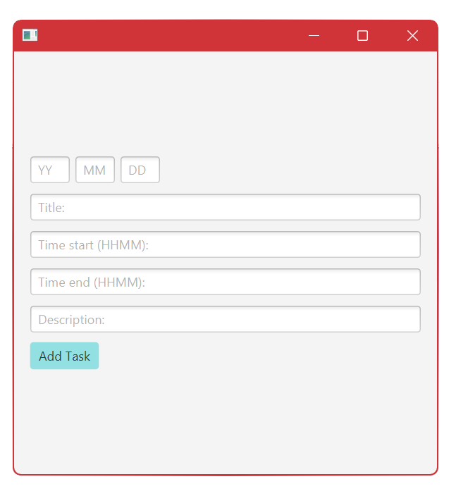

The add task pop up allows users to fill in the relevant information to add a new task to their planner account!
The date is represented as YYMMDD, and the hour as HH:MM.
So the example task shown will create the “Hello!” task for April 12th, 2026, and it will span from 12pm to 2pm, with the description “Hello!”

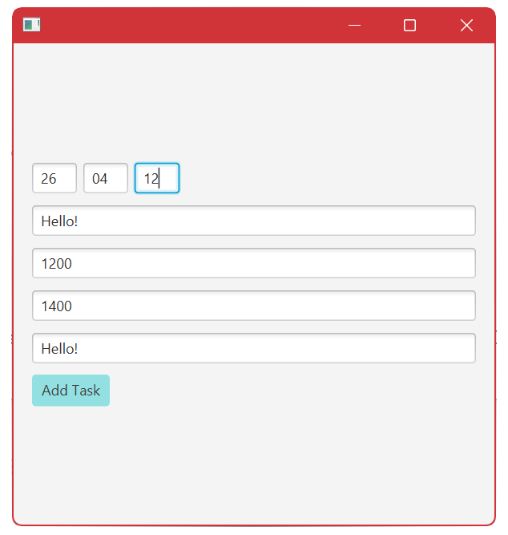

### Music Box
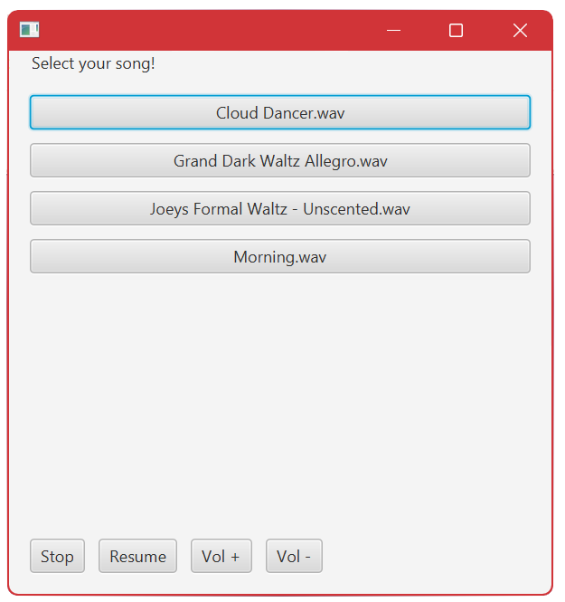

Our primary wow factor! This popup allows the user to choose what song they want to listen to, change the volume, or start/stop music!
Controlled by our Audio.java class.

### Color Customization
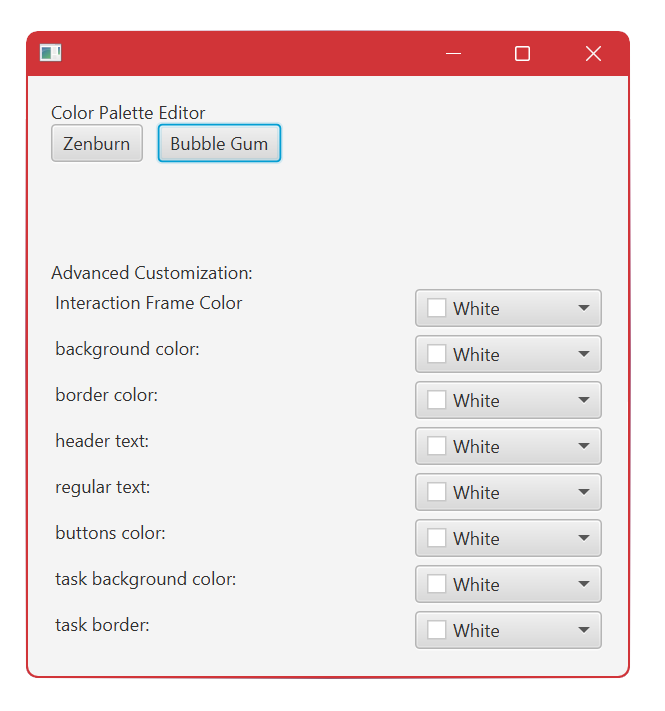

Users can pick from premade color palettes to change their planner to!
Optionally, they can change specific aspects of their planner to be different colors!
This popup works with the assistance of the ColorPicker class from JavaFX!

The theme primarily used in our exmaples is Bubble Gum!

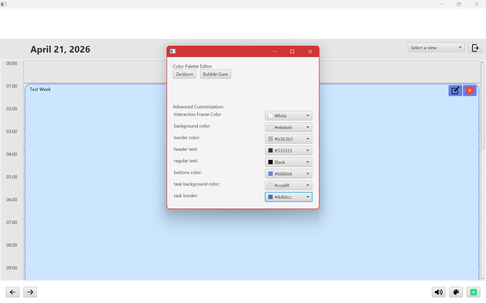

## Networking
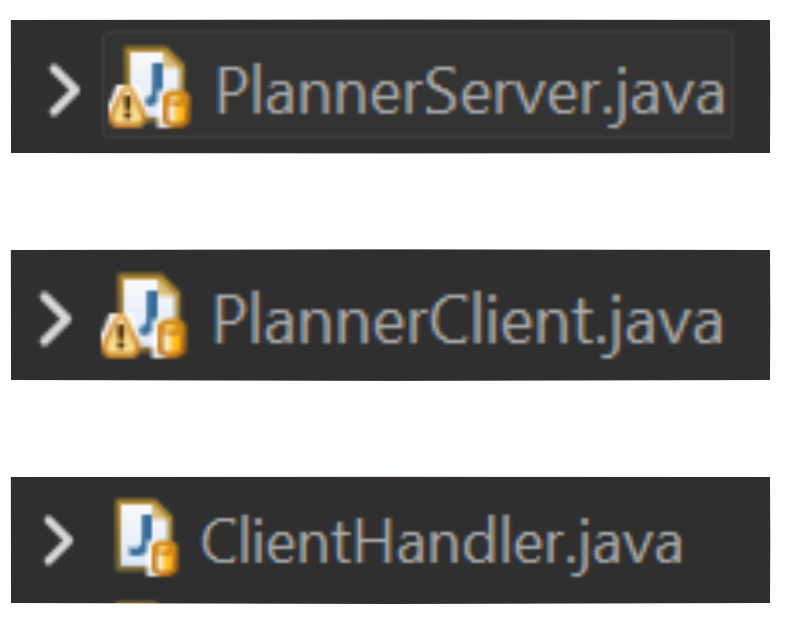

The PlannerServer hosts the PlannerClients on port 4000 to connect to them and ClientHandler handles all the server side operations for the client and sends tasks to the server and which then the server broadcasts the tasks to the planner.

## Persistent Data
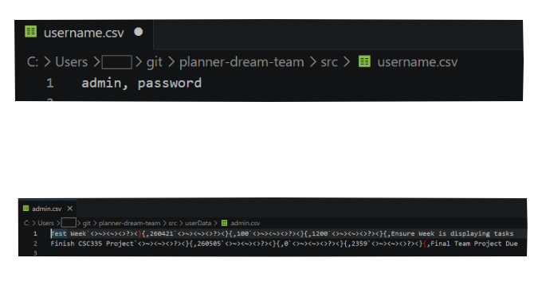

Utilizes username.csv to store all usernames and passwords that can be logged in. 
Then inside our UserData folder, there is a .csv file named after the user whose data it is storing. These CSV files store task and customization data. This CSV is updated after every log out or window close!

Credits:
- Duc Tan Tran
- Paloma Ortiz
- Braa Oudeh
- Khanh Nguyen
